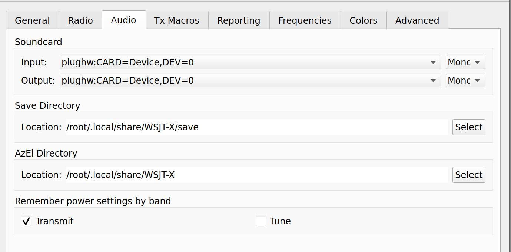

https://gist.github.com/danupp/57d8eb0f60837e782617bacd1b4a069e
https://aaron-brown.dev/radio/2019/09/07/running-wsjtx-in-docker.html

once in the container, run
```bash
/wsjtx/output/bin/wsjtx
```
to start the application

## Sound

sound setup can be tricky.

to find out what devices are available
```bash
cat /proc/asound/cards
 0 [Generic        ]: HDA-Intel - HD-Audio Generic
                      HD-Audio Generic at 0x905c8000 irq 111
 1 [Generic_1      ]: HDA-Intel - HD-Audio Generic
                      HD-Audio Generic at 0x905c0000 irq 112
 2 [Device         ]: USB-Audio - USB Audio Device
                      C-Media Electronics Inc. USB Audio Device at usb-0000:c1:00.3-1, full speed
```

In my case the last one appears/disappears when I plug/unplg the audio cable. It's name is `Device` so I looked for that in the wsjtx list of audio devices. 



you can adjust the sound levels with `alsamixer` on the command line.

## radio setting

### Yaesu FT-891

my radio is a Yaesu FT-891. To use the data cable with a usb adaptor, make sure that you set the mic input to the rear input. 


https://www.n4nrv.org/hints-and-kinks-of-the-yaesu-ft-891/

### RTL-SDR

I have not tried this, it's another person's example
https://jeremyclark.ca/wp/telecom/rtl-sdr-for-wsjt-x-wspr/

## Maidenhead lookup

The location setting is the maidenhead grid coordinates, they can be found here:
https://www.levinecentral.com/ham/grid_square.php

